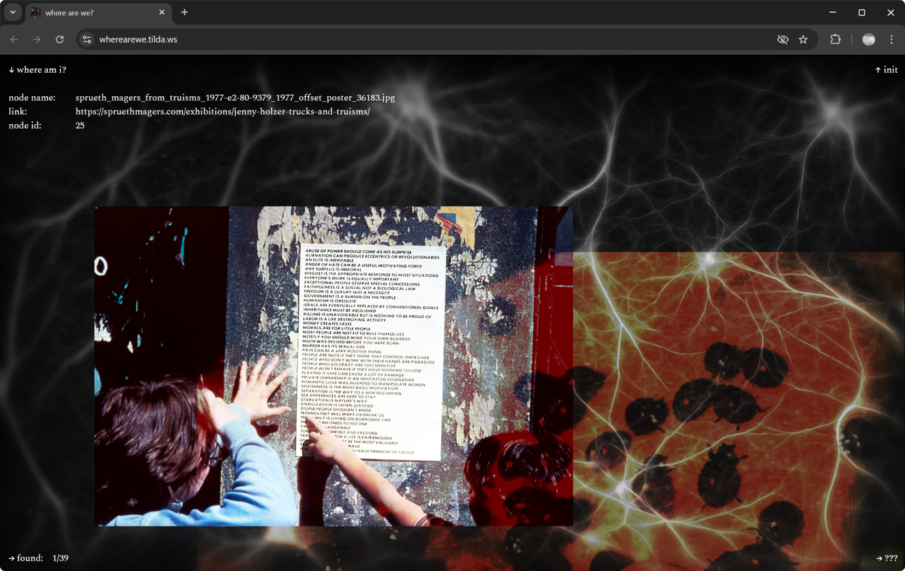
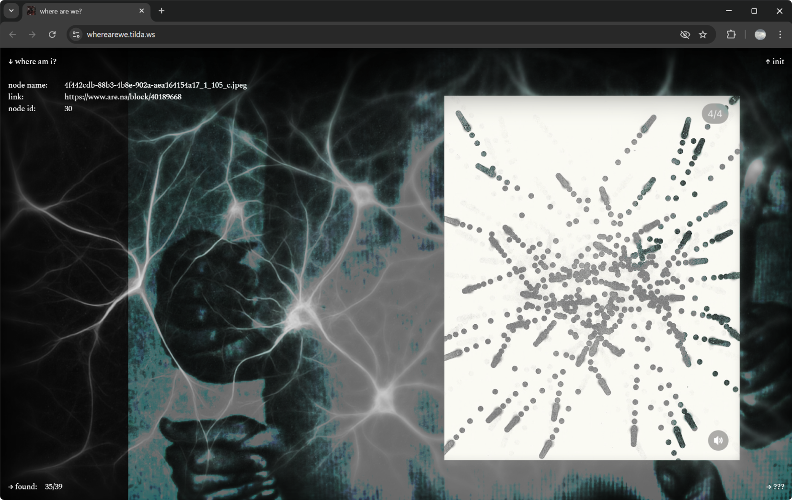

# Where are we? — a long-form interactive essay on artificial intelligence  
Student project

👉 Read: https://dunchekk.github.io/stud-2_01-struct-lending/

### Description

> Artificial intelligence is a technology that reshapes the fabric of our lives and challenges established notions and concepts. It has become an actor too influential to be ignored.
>
> *Where Are We?* is a rhizomatic longread exploring the development of AI through a post-structuralist framework. It is an attempt to assemble what remains familiar and relevant in order to establish a more stable theoretical footing within a rapidly changing world.

The main body of the longread consists of 39 nodes. On each page load, they are assigned new coordinates within the field in a randomly generated order. As a result, every refresh produces a different reading experience.

More about the concept (ru): https://hsedesign.ru/project/68c8e820ce34431f8b13106c561fac78

### Tech Stack

- `Vite` — dev server and build tool.
- `PixiJS` (via CDN) — background graphics/video and effects.
- `Vanilla JS` (ESM) — nodes, overlays, and interactions logic.
- `CSS` — animations, responsive styles, blending effects.

### Structure

```text
src/
├── main.js                     — entry point: imports CSS and enables all modules (pixi/field/handlers/loader).
├── components/
│   ├── activeDragging.js       — drag-to-scroll for `#main-field-wrapper` (mouse drag instead of scrolling).
│   ├── imgControl.js           — “floating” images: spawn/animation/stop.
│   ├── initMainField.js        — field initialization: load data (JSON), calculate sizes, layout and render nodes, resize.
│   ├── introField.js           — init overlay logic — `#inition-field`: text block, paging, close.
│   ├── initUI.js               — UI sync when opening/closing the init overlay.
│   ├── loading.js              — hides the loading screen when field+pixi+media are ready (with a timeout fallback).
│   ├── observer.js             — IntersectionObserver for `.map-item` (reveal/in-view) + one-time field centering.
│   ├── pixi.js                 — PixiJS background: video texture, blur/mask (desktop), parallax on field scroll.
│   ├── questionField.js        — "explanation" overlay (`#blending-explanation`): open/close, animations, low-perf mode.
│   └── renderers.js            — node rendering: images/video + hover effects, text cards + wheel/swipe paging.
└── css/
    ├── adaptives.css           — responsive styles.
    ├── blending-modes.css      — overlay styles (questions/init), animation utilities, floating images, UI elements.
    ├── eges.css                — “edges” (edge overlays): gradients/blur top/bottom/left/right.
    ├── font.css                — font (Spectral) and base global typography.
    ├── keyframes.css           — keyframes for fade/invert animations (blendFadeIn/Out, htmlInverseIn/Out).
    ├── nodes.css               — node styles (`.text-el`, `.pic-el`, `.map-item`), reveal animation, low-perf simplifications.
    ├── pixi.css                — Pixi container wrapper and classes for inversion animation.
    └── style.css               — base layout: hiding scrollbars, field sizes/scroll, cursor.
```
### Screenshots





